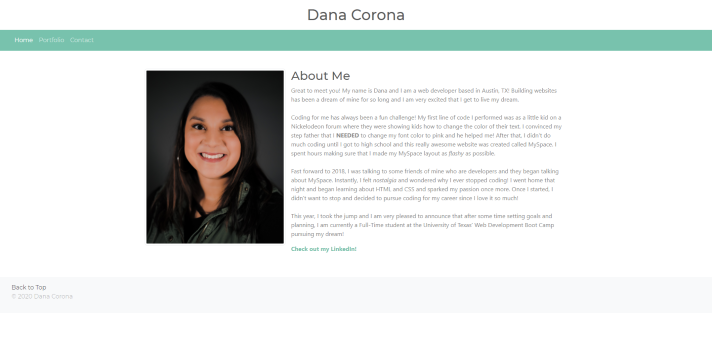

# My Portfolio

Building websites has been a dream of mine for a long time and I'm excited to be able to share my journey with you! Currently, I am attending University of Texas' Full Stack Web Developer Boot Camp where we are learning HTML, CSS, as well as JavaScript. In my portfolio, you'll find a little bit of background information about me, a look into some of the awesome projects that I've built, as well as my contact page. My journey with web development will never stand still, as I am always wanting to learn and grow and become a better developer.

[View My Portfolio Here](https://danacorona.github.io/)

# Screenshots

